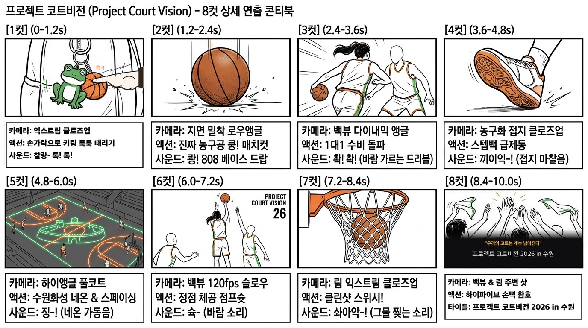

# 🎬 DIRECTOR'S CUT: PROJECT COURT VISION (프로젝트 코트비전)
### 2026 제1회 경기남부 여성 농구 리그 공식 8컷 마스터 콘티북

> **"우리의 코트는 계속 넓어진다."**  
> 하나의 키링에서 출발한 일상의 불꽃이, 1대1 돌파와 스텝백, 수원화성의 코트 확장, 그리고 전율의 스위시와 축제 환호로 폭발하는 8컷 완성형 마스터피스.

---

## 📽️ PRODUCTION SPECS (제작 사양)

* **타이틀**: 프로젝트 코트비전 (Project Court Vision) 1st 리그 in 수원
* **러닝타임**: 00:08:00 ~ 00:10:00 (완벽한 인과관계와 템포 완급 조절)
* **화면비**: 9:16 Vertical (인스타그램 릴스 / 유튜브 쇼츠 / 틱톡 최적화)
* **스토리 구조**:
  - `01. 일상의 장난`: 개구리+농구공 일체형 키링 툭툭 장난치기
  - `02. 각성의 매치컷`: 미니 공 ➔ 진짜 가죽 농구공 쾅! (808 베이스 드랍)
  - `03. 1대1 매치업`: 상대 여성 수비수를 찢고 들어가는 포니테일 돌파
  - `04. 스텝백 급제동`: 슛 찬스를 만들기 위한 농구화 바닥 제동 접지음 (*끼익-!*)
  - `05. 시야의 확장`: 발끝 충격파로 바닥에 수원화성 네온 라인이 켜지며 팀원들이 코너로 스페이싱
  - `06. 정점 체공 점프슛`: 수비 위로 붕 떠오른 점프슛 릴리즈 (`PROJECT COURT VISION 26`)
  - `07. 클린샷 스위시`: 백색 그물이 위로 뒤집히는 쾌감의 득점 (*솨아악-!*)
  - `08. 얼굴 없는 축제 환호`: 쏟아지는 하이파이브 손뼉 릴레이 + 벤치 타월 펄럭임 + 엔딩 타이틀

---

## 🖼️ VISUAL STORYBOARD SHEET (8-CUT MASTER)



---

## 🎞️ 8-CUT DETAILED DIRECTOR'S BREAKDOWN (씬별 연출 지시서)

---

### [컷 1] 개구리+농구공 키링 손가락 툭툭! [0.0s ~ 1.2s] ★키링 타격 모션
* **구도**: **Extreme Close-Up (ECU)** / 85mm Macro f/1.8
* **소품**: 하나의 메탈 링에 **초록 개구리 인형**과 **미니 주황 농구공**이 나란히 매달려 있는 일체형 키링.
* **액션**: 벤치 위 가방에 걸린 키링을 **검지손가락으로 툭! 툭! 장난스럽게 때리고 튕김.** 개구리와 미니 농구공이 서로 부딪히며 앞뒤로 격렬하게 흔들림.
* **사운드**: 찰랑- 톡! 톡! (가벼운 쇠소리 + 인형 부딪히는 둔탁한 소리)
* **트랜지션**: 장난치다 미니 농구공을 렌즈 정면으로 툭 튕기는 순간 화면 암전!

---

### [컷 2] 진짜 농구공 쿵! [1.2s ~ 2.4s]
* **구도**: **지면 밀착 로우앵글 (Low-Angle Floor)**
* **액션**: 암전이 걷히며 미니 공이 바닥에 닿는 순간 **진짜 가죽 농구공으로 변신(Match-Cut)**하여 바닥을 쾅! 찍음.
* **사운드**: **쾅! (심장을 때리는 808 베이스 비트 드랍)**

---

### [컷 3] 1대1 수비 돌파 [2.4s ~ 3.6s]
* **구도**: **Dynamic Back View (선수 등 뒤)**
* **액션**: 포니테일 머리칼이 채찍처럼 좌우로 날리는 주인공이, 견고하게 버티고 선 **상대 여성 수비수를 페이크와 폭풍 크로스오버로 제치며 파고듦!**
* **사운드**: 촥! 촥! (바람 가르는 드리블 소리) + 수비수 스텝 소리

---

### [컷 4] 스텝백 급제동 접지음 [3.6s ~ 4.8s] ★동작 인과관계 해결
* **구도**: **Extreme Close-Up (농구화 밑창과 코트 바닥)**
* **액션**: 수비를 흔든 후, **슛 찬스를 만들기 위해 순간적으로 뒤로 빠지는 스텝백 제동!** 농구화 밑창이 우드 바닥을 짓이기며 멈춰 서는 브레이크 샷.
* **사운드**: **끼이익-!** (가슴 찌릿한 스니커즈 접지 마찰음)

---

### [컷 5] 수원화성 네온 & 스페이싱 [4.8s ~ 6.0s] ★공간 점프 자연스러운 해결
* **구도**: **High-Angle Full Court View**
* **액션**: 
  - 스텝백으로 농구화가 코트를 디딛는 순간, **발끝에서 충격파가 일듯 오렌지 네온 빛이 우드 바닥을 타고 촥 번져나감.**
  - 코트 바닥 중앙에 **'수원화성 성곽 능선 실루엣'**이 네온 라인으로 완성되며, 동시에 **양 코너로 2~3명의 팀원들이 와르르 스페이싱을 벌림!**
* **사운드**: 웅장한 네온 가동음 (*위이잉-!*) + 체육관 앰비언스

---

### [컷 6] 정점 체공 점프슛 [6.0s ~ 7.2s]
* **구도**: **Medium Back View (120fps 슬로우모션)**
* **액션**: 
  - 스텝백 공간 위로 붕 솟구쳐 오른 주인공의 점프슛 체공 뒷모습.
  - 유니폼 등판에 굵직하게 박힌 **`PROJECT COURT VISION 26`** 선명 노출.
  - 가장 높은 정점에서 공을 놓는 완벽한 손목 스냅(팔로우스루).
* **사운드**: 순간 진공 상태의 고요함 + 공이 바람 가르는 소리 (*슉-*)

---

### [컷 7] 클린샷 스위시! [7.2s ~ 8.4s]
* **구도**: **Low Angle Rim Extreme Close-Up**
* **액션**: 날아온 공이 백보드도 안 스치고 림 정중앙을 관통. **순백색 그물망이 위로 촥-! 뒤집혀 털리는 슬로우모션!**
* **사운드**: **솨아악-!** (가장 시원하고 묵직한 클린샷 그물 소리)

---

### [컷 8] 하이파이브 환호 & 엔딩 공식 타이틀 [8.4s ~ 10.0s] ★얼굴 없는 축제 & 공식 타이틀
* **구도**: **주인공 등 뒤(Back View) & 림 주변 샷**
* **액션**: 
  - 득점 순간, 화면 밖에서 **팀원들의 손들이 일제히 날아와 주인공의 손과 부딪히는 하이파이브 손뼉 릴레이!**
  - 배경 벤치에선 **타월들이 공중으로 펄럭이며 던져지는 축제 환호의 실루엣.**
  - 화면 중앙에 볼드한 그래픽 타이틀과 공식 대회명 등장:
    ```text
    "우리의 코트는 계속 넓어진다"
    프로젝트 코트비전 2026 in 수원
    ```
* **사운드**: 손뼉 부딪히는 소리 (*촥! 촥!*) + 폭발적인 환호성 ➔ 심판 호각 (*삑-!*) ➔ 묵직한 베이스 쿵!
