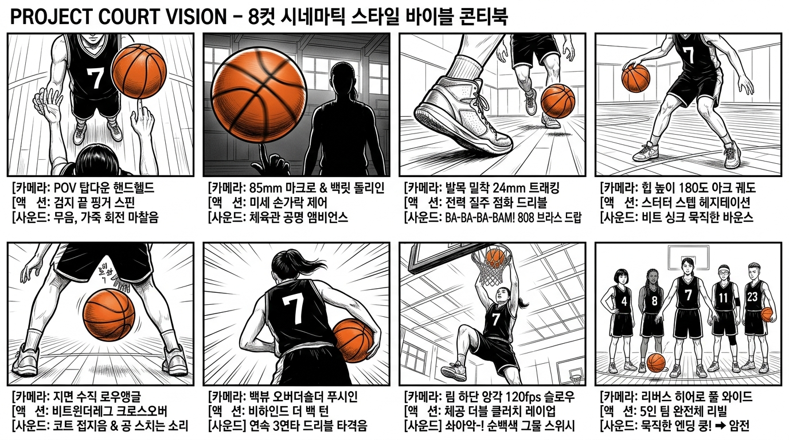

# 🎬 PROJECT COURT VISION: 팀 비전 8컷 시네마틱 스타일 바이블 콘티북

> **"하나의 회전하는 농구공에서 시작된 폭발적인 질주, 그리고 마침내 완성된 5인의 라인업."**  
> 35mm 필름 질감과 고대비 흑백+오렌지 시네마토그래피로 직조한 10초 나이키/조던급 릴스·쇼츠 마스터피스.

---

## 📽️ STYLE BIBLE (전 컷 공통 스타일 규정)

* **포맷**: 9:16 Vertical (세로형 인스타그램 릴스 / 유튜브 쇼츠 최적화), 24fps
* **톤앤매너**: 35mm 필름 질감(Filmic Grain), 강한 명암 대비(High Contrast), 차분하게 감쇄된 쿨톤 섀도우(Cool Shadows) + 피부 위의 따뜻한 하이라이트(Warm Highlight). *카툰이나 CGI 느낌이 배제된 날것의 리얼한 스포츠 포토그래피.*
* **로케이션**: 빈 관중석과 높은 천장 형광등이 있는 실내 하드우드 농구 체육관. 파란색과 노란색 테이프 라인이 그어진 연한 메이플 우드 바닥, 창문을 통해 쏟아지는 강한 역광과 공기 중에 떠다니는 미세한 먼지 입자.
* **주인공 (HERO)**:
  - 20대 초반 한국 여성, 단단하고 탄탄한 운동선수 체형.
  - 뒤로 높고 단단하게 묶어 올린 하이 포니테일(High Ponytail).
  - 블랙 슬리브리스 농구 유니폼 (화이트 넘버 **7**), 블랙 쇼츠, 블랙 하이탑 농구화, 화이트 삭스.
  - 주황색 가죽 몰텐(Molten) 스타일 시합구.

---

## 🖼️ 한 장으로 보는 8컷 마스터 콘티 보드



---

## 🎞️ 8컷 씬별 시네마틱 연출 지시서 (Director's Breakdown)

| 컷 | 타이틀 & 타임코드 | [카메라 & 앵글] | [액션 연출 디렉팅] | [사운드 디자인 & 음악] |
| :-: | :--- | :--- | :--- | :--- |
| **1컷** | **POV 탑다운 핑거스핀**<br>`0.0s ~ 1.2s` | **1인칭 탑다운 시점**<br>(POV Top-Down Handheld) | 선수의 눈높이에서 내려다본 샷. 블랙 7번 유니폼 품에 농구공을 안고 있다가 위로 툭 튕겨 **오른쪽 검지 끝에 올려 맹렬히 회전**시킴. 아래로 우드 바닥과 하이탑 농구화가 보임. | **음악 없음(NO MUSIC)**<br>가죽이 피부 위에서 쉭쉭 도는 마른 마찰음 + 텅 빈 체육관의 미세한 앰비언스 웅웅거림. |
| **2컷** | **85mm 마크로 & 역광 실루엣**<br>`1.2s ~ 2.4s` | **85mm 매크로 & 로우 와이드**<br>(Macro Shallow DOF ➔ Ground Dolly-In) | 회전하는 농구공 솔기선이 뭉개지는 초근접 샷 ➔ 체육관 역광 창문 앞에 우뚝 선 **선수의 칠흑 같은 암부 실루엣과 손가락 위에서 계속 도는 공**. | 먼 곳에서 울리는 희미한 신발 접지음(*끼익-*) 1회 + 선수의 깊은 숨소리 하나. |
| **3컷** | **발목 워킹 & 폭발적 점화**<br>`2.4s ~ 3.6s` | **지면 밀착 24mm 트래킹 돌리**<br>(Ankle-Height Whip-Tracking) | 바닥을 천천히 걷는 하이탑 스니커즈와 신발끈의 디테일. 나른하게 공을 한 번 퉁 튀기더니, **예고 없이 전방 카메라를 향해 전력 질주하며 코트 바닥을 쾅! 강타하는 첫 드리블 폭발!** | 첫 1~2초 정적 ➔ 첫 발을 내딛는 순간 **"BA-BA-BA-BAM!" 묵직한 브라스 오케스트라 스타카토 & 808 킥, 공격적인 트랩 드럼 폭발 드랍!** |
| **4컷** | **180도 궤도 헤지테이션**<br>`3.6s ~ 4.8s` | **힙 높이 180도 아크 궤도**<br>(Hip-Height Orbit Camera) | 선수의 허리 높이에서 180도 고속 회전하는 카메라. 스터터 스텝으로 허공에 공이 붕 멎는 듯한 **스킵/헤지테이션 드리블** 후 바닥으로 스냅. | 묵직한 1번째 드럼 비트에 정확히 싱크되는 바닥 슬랩 소리 + 고무 밑창의 찌릿한 스퀴크. |
| **5컷** | **지면 수직 비트윈더레그**<br>`4.8s ~ 6.0s` | **바닥 수직 로우앵글**<br>(Reverse Low Angle Floor) | 바닥에서 수직으로 올려다보는 로우앵글. 카메라 렌즈 코앞 몇 센티미터를 스치며 **양 다리 사이를 찢고 지나가는 강력한 비트윈더레그 크로스오버**. | 2번째 드럼 비트에 맞춰 촥! 터지는 드리블음 + 다리를 찢는 선수의 폭발적인 스텝. |
| **6컷** | **어깨 너머 비하인드백**<br>`6.0s ~ 7.2s` | **오버 더 숄더 푸시인**<br>(Over-the-Shoulder Push-In) | 7번 등판 바로 뒤에서 림을 향해 쇄도하는 카메라. **등 뒤로 공을 유연하게 감아돌리며(Behind-the-Back)** 림 정면으로 진입. | 3번째 드럼 비트 타격음 + 몰아치는 타악기 퍼커션 비트. |
| **7컷** | **120fps 체공 더블클러치**<br>`7.2s ~ 8.4s` | **림 하단 앙각 120fps 슬로우**<br>(Rim-Level Speed Ramp) | 두 걸음 도약 후 한 발로 림을 향해 날아오름. 공중에 붕 뜬 채 수비 블록을 피해 **공을 몸 안쪽으로 끌어당겼다가 다시 뻗는 더블 클러치(Double Clutch)** ➔ 백보드 맞고 핑거롤 득점! | 체공 순간 **음악이 가늘어지며 단 하나의 브라스 서스테인 음만 유지(진공 상태)** ➔ 림 통과 순간 **솨아악-! 순백색 그물 스위시와 림 사운드가 묵직하게 재폭발!** |
| **8컷** | **팀 완전체 리버스 샷 (엔딩)**<br>`8.4s ~ 10.0s` | **오버더숄더 ➔ 대칭 히어로 와이드**<br>(Symmetrical Hero Wide Push-In) | 공이 바닥에 통... 통... 튀며 소리가 가까워짐. 등 돌린 7번의 어깨가 숨으로 들썩이다가 고개를 돌려 뒤를 바라봄.<br>**[리버스 앵글] 하프라인에 위풍당당하게 선 4명의 한국 여성 팀원들:**<br>• **4번**: 키 크고 날렵한 숏보브 단발<br>• **8번**: 긴 머리를 땋아 내린 브레이드 헤어<br>• **11번**: 헤어밴드와 스포츠 고글 안경<br>• **23번**: 짧은 투블럭 언더컷<br>다들 차분하고 압도적인 자신감으로 렌즈를 응시. 그중 한 명이 손가락 위에 공을 무심하게 돌리고 있음. | 공 바운스 메아리가 잦아들며 얇아지는 스코어 ➔ **마지막 슬로우 푸시인과 함께 화면 암전(Hard Cut to Black)되는 순간 최종 다운비트 쿵!** |

---

## 🎧 사운드 & 음악 완급조절 (Sound Dynamics)

```text
[0.0s ~ 2.4s]  절대적 고요 (무음) : 손가락 가죽 회전음, 희미한 체육관 공명, 거친 숨소리
      ⬇
[2.4s ~ 3.6s]  폭발적 드랍 (DROP) : "BA-BA-BA-BAM!" 오케스트라 브라스 스타카토 + 808 킥
      ⬇
[3.6s ~ 7.2s]  3단 콤보 비트 싱크 : 드럼 비트 1타(헤지테이션) - 2타(비트윈) - 3타(비하인드백)
      ⬇
[7.2s ~ 8.4s]  무중력 진공 상태 : 더블 클러치 체공 중 단일 브라스음 서스테인 ➔ '솨아악-!' 그물 스위시
      ⬇
[8.4s ~ 10.0s] 긴장감 넘치는 여운 : 통... 통... 공 바운스 ➔ 5인 팀원 노려봄 ➔ 암전과 함께 쿵!
```
